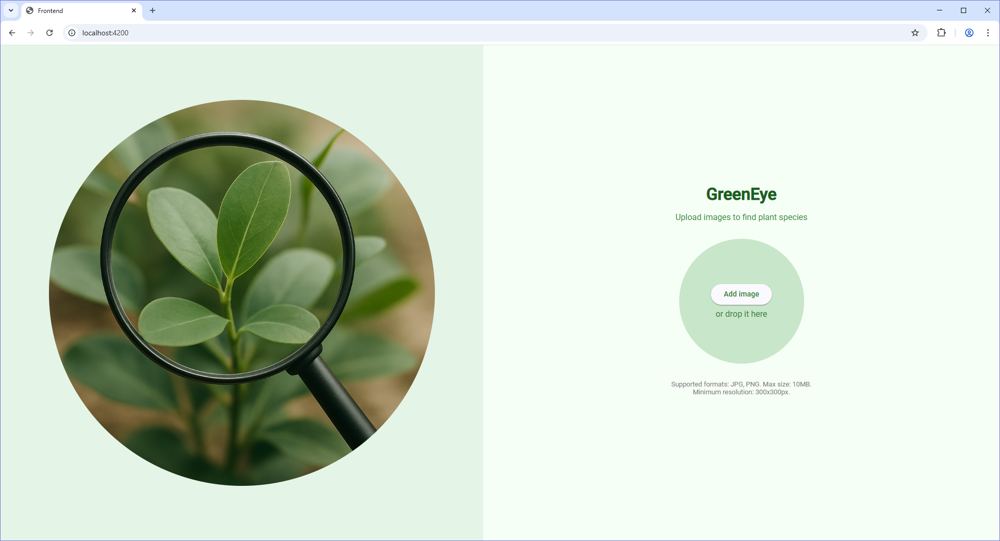
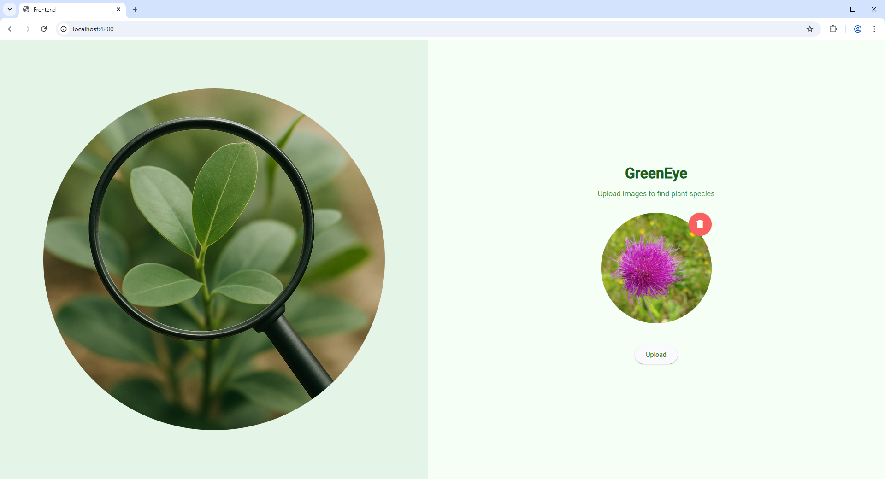
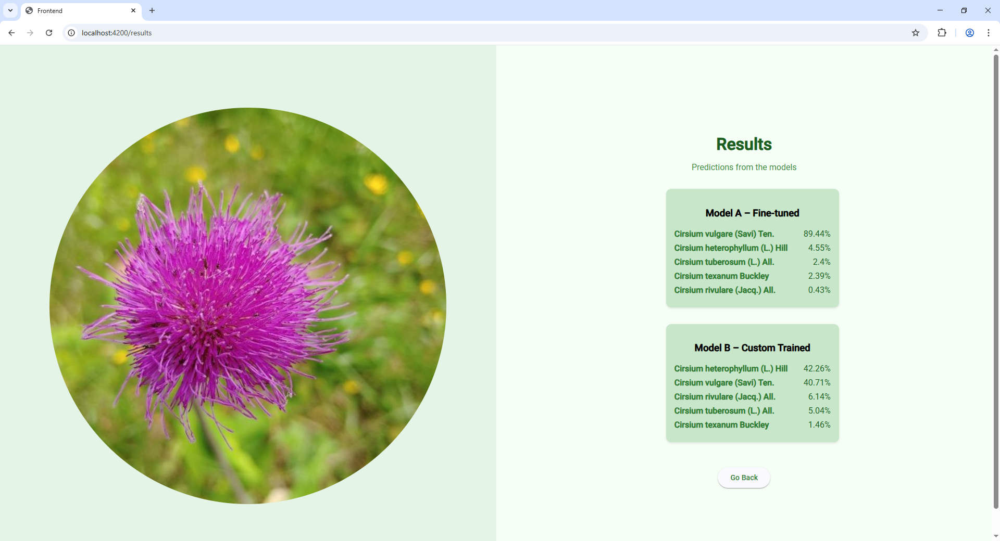

# GreenEye

GreenEye is an application designed to identify plant species based on a picture uploaded by the user. It outputs a ranked list of the top five most likely plant species, based on two machine learning models: a pretrained model (Pl@ntNet-300K) and a custom model trained by the development team. 

---

## 📁 Project Structure

```
GreenEye/
├── backend/      # Python backend API and ML inference
├── frontend/     # Angular frontend application
├── Documentation/ # Project documentation and plans
├── ML/           # Machine learning scripts and experiments
├── PlantDatasetSubsetRepo/ # Plant datasets
├── PlantSubset/  # Additional plant data
├── Report/       # Project reports and LaTeX sources
├── docker-compose.yaml # Orchestration for frontend and backend
├── LICENSE
└── README.md
```

---

## 🚀 How It Works

1. **User uploads an image**  
   The Angular frontend provides a drag-and-drop or file upload interface.

2. **Image sent to backend**  
   The frontend sends the image to the backend API for analysis.

3. **Backend processes the image**  
   The Python backend runs a machine learning model to identify plant species.

4. **Results displayed**  
   The frontend shows the predicted species and confidence scores.

---

## 🖼️ Screenshots

###  Add image 


###  Upload image 


### Results 


---

## 🐳 Running with Docker Compose

1. Build and start the app:
   ```sh
   docker-compose up --build
   ```
2. Access the frontend at [http://localhost:4200](http://localhost:4200)  
   The backend API will be available at [http://localhost:8000](http://localhost:8000)

---

## 📄 License

This project is licensed under the MIT License - see the [LICENSE](LICENSE) file for details.
